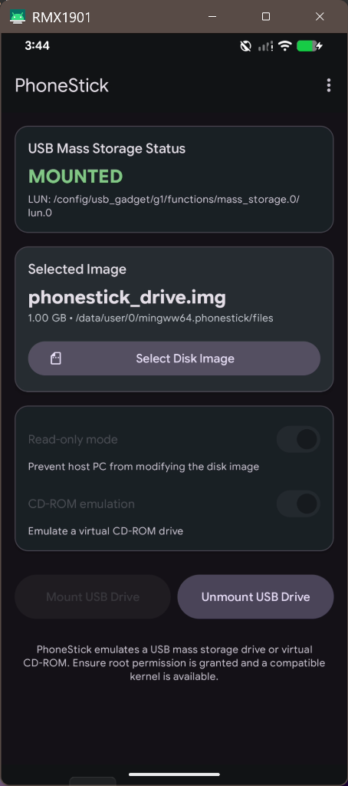

# PhoneStick 📱💾

<p align="center">
  
</p>

<p align="center">
  [English](README.md) | 简体中文
</p>

<p align="center">
  <a href="https://github.com/DistrictBlauw/PhoneStick/actions/workflows/build.yml">
    
  </a>
</p>

PhoneStick 基于 Android 内核的 ConfigFS 与 USB gadget 驱动，把已 Root 的 Android 设备变成一个 U 盘（USB 大容量存储设备）或虚拟光驱。

<p align="center">
  
</p>

## 功能特性

- **Material Design 3**：现代简洁的界面，支持动态亮/暗主题与快速操作悬浮按钮。
- **挂载原始磁盘镜像**：直接把 `.img`、`.iso`、`.bin`、`.raw`、`.vhd`、`.qcow2` 文件挂载为 U 盘或光盘。
- **零拷贝 SAF 解析**：把外部存储 URI（SD 卡、下载目录）直接解析为 Linux 内核路径，无需复制文件。
- **模拟模式**：支持只读模式与虚拟光驱模式。
- **ConfigFS 与 Sysfs 双支持**：直接绑定 Android ConfigFS（`/config/usb_gadget/g1` 和 `/sys/kernel/config`）以及 sysfs LUN 目标。
- **一加 / OPPO / realme 适配**：针对 ColorOS / OxygenOS 原生适配，直接在 configfs 上编排 mass storage 功能并重绑 UDC，完全不依赖 `sys.usb.config`。
- **详细日志与导出**：所有操作（Root 检测、策略选择、shell 命令结果、备份/恢复校验）都记录到持久化的应用内日志中，可查看、导出并以纯文本分享。
- **空白镜像创建**：在应用内即可分配并格式化空白磁盘镜像。

## 安装

- **GitHub Release**：从 [Releases](https://github.com/DistrictBlauw/PhoneStick/releases) 下载最新 APK。
- **CI 构建**：每次推送都会通过 [GitHub Actions](https://github.com/DistrictBlauw/PhoneStick/actions/workflows/build.yml) 自动构建 debug 和签名 release APK，可在 Actions 页面的构建产物（Artifacts）中获取；推送 `v*` 标签时自动发布 Release。
- **F-Droid**：构建配方与元数据见 [`metadata/mingww64.phonestick.yml`](metadata/mingww64.phonestick.yml)。

## 环境要求

- 已 Root 的 Android 设备（Magisk / KernelSU / APatch）
- 内核支持 USB Mass Storage gadget（`CONFIG_USB_F_MASS_STORAGE` 或 ConfigFS）

## OPlus（一加 / OPPO / realme）适配原理

ColorOS 把 configfs 挂载在 `/config`，并预创建了带 `mass_storage.0` 功能实例的
`usb_gadget/g1`，但其 init 从不会把 `mass_storage` 编排进 `sys.usb.config`，
因此经典的 `setprop` 切换完全无效。PhoneStick 的做法是：

1. 读取当前 UDC（`sys.usb.controller`，如 `a600000.dwc3`）并把 `g1` 从其上解绑。
2. 填充 `functions/mass_storage.0/lun.0`（`file`、`ro`、`cdrom`、`removable`、`stall`）。
3. 把 `functions/mass_storage.0` 软链接进当前激活的 config（`configs/b.1`），
   ADB/MTP 作为复合设备继续可用。
4. 重新绑定 UDC，主机重新枚举后即可看到磁盘。

如果你的 OPlus 版本在 SELinux Enforcing 下拒绝 root 写 configfs，应用只会在写入
LUN 的瞬间临时切换到 permissive，写入完成后立即恢复 enforcing。

## 配置备份与恢复

挂载前，PhoneStick 会把原始 USB gadget 状态快照保存到应用私有存储：

- UDC 绑定（如 `a600000.dwc3`）
- 每个 gadget config 内的全部功能软链接
- 每个 mass_storage LUN（`file` / `ro` / `cdrom`）及 `stall` 标志
- 旧款设备上还会保存原始的 `sys.usb.config` 值

卸载时按快照精确还原：剥离 mass_storage 链接、重建挂载前已有的链接、回写 LUN
参数、重新绑定之前保存的 UDC。还原结果会逐项校验，一旦有失败项，备份会被保留，
你只需再次点击卸载即可重试。快照从不被重复挂载覆盖，因此还原目标永远是最初的真实
状态。

## 日志与诊断

从主菜单打开 **日志** 即可查看持久化的应用日志（按级别着色、最新在前）。它记录了
设备信息、Root 检测、OPlus 识别、策略选择、每条 shell 命令的退出码 / stdout /
stderr、备份快照与恢复校验结果。通过工具栏菜单可以把日志导出到任意位置、以 `.txt`
附件形式分享或清空。日志在应用重启后依然保留（最多 2000 条 / 512 KB）。

## 本地构建

```bash
git clone https://github.com/DistrictBlauw/PhoneStick.git
cd PhoneStick
./gradlew assembleDebug     # 调试版 APK
./gradlew assembleRelease   # 签名发布版 APK（仓库自带签名配置）
```

要求 JDK 17；Gradle 8.7 / AGP 8.5.0 / Kotlin 1.9.24 会由 wrapper 自动下载。

## 多语言

英语、德语、法语、意大利语、立陶宛语、简体中文。

## 许可证

[MIT License](LICENSE)

原始作品来自 streetwalrus、dratini0、donfanning、Swyter 与 JinbaIttai。
